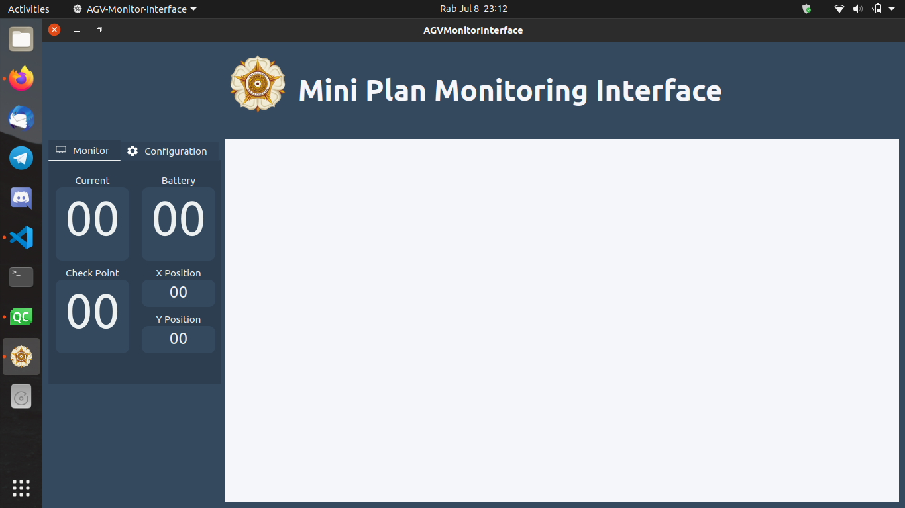
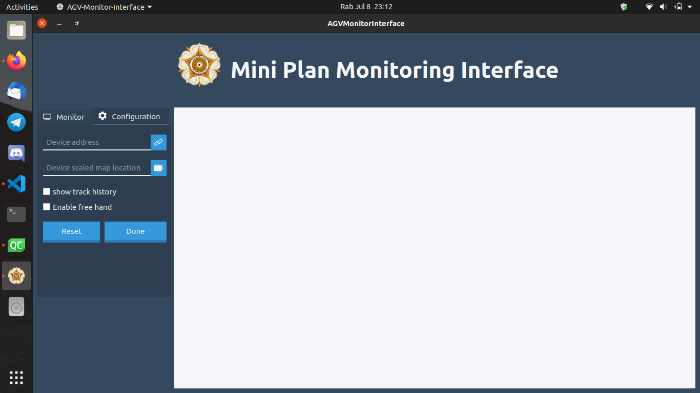
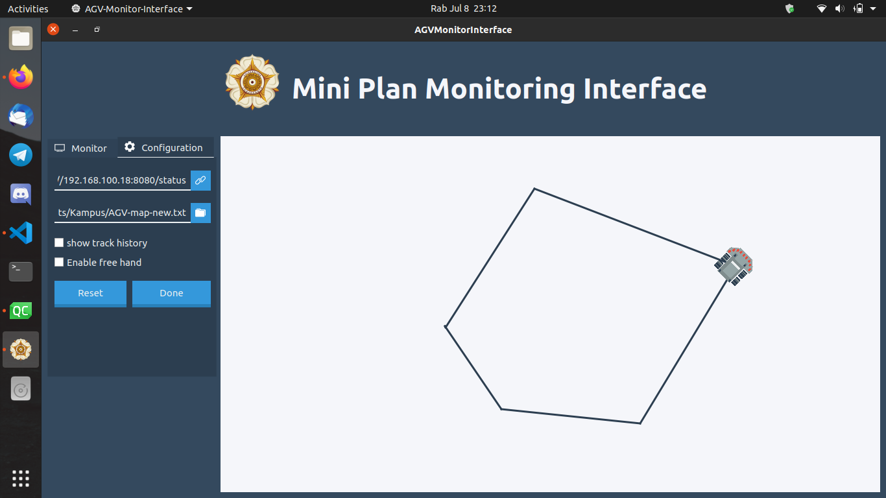

# Mini-Plan-Monitoring
Software monitoring mini plan berbasis IoT. Tugas Kekaryaan 2020
dengan Pak Fakih Irsyadi, S.T, M.T sebagai pembimbing project

# Tampilan Default Software Monitoring

Penjelasan list monitoring data
1. Current, menampilkan data arus motor saat device aktif
2. Battery, menampilkan tegangan baterai yang tersisa
3. Check Point, menampilkan posisi check point dari device
4. X Position, monitor posisi garis X dari device
5. Y Position, monitor posisi garis Y dari device

# Tampilan Pengaturan Untuk Konektivitas, dan Map

Detail opsi menu pengaturan
1. Kolom device address merupakan kolom yang wajib diisi berupa alamat dari device yang aktif, setelah diisi dengan alamat device (contoh http://192.168.0.1/) tekan tombol connect untuk menyambungkan software dengan device
2. Scaled map digunakan untuk membuka berkas map dari lintasan device yang kemudian akan ditampilkan pada jendela render
3. Show track history, berguna untuk mengaktifkan history atau jejak device. Di fungsikan sebagai cetakan untuk menggambar map
4. Enable free hand, memberikan interaksi user pada jendela render untuk menggambar map berdasarkan jejak/history device
5. Tombol reset, digunakan untuk menghapus/membersihkan jendela render
6. Tombol Done, digunakan untuk menyimpan data *Enable free hand* menjadi berkas map.

# Tampilan Software Saat Uji Coba

